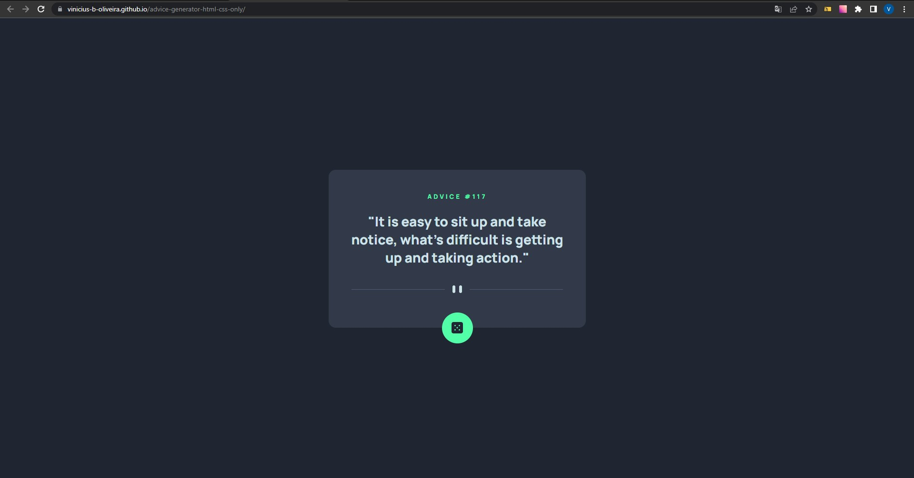

# Frontend Mentor - Advice Generator com HTML e CSS apenas

Essa é a minha solução para o desafio [Advice generator app challenge on Frontend Mentor](https://www.frontendmentor.io/challenges/advice-generator-app-QdUG-13db) usando apenas HTML e CSS.

## Sumário

- [Visão Geral](#visão-geral)
  - [Desafio](#desafio)
  - [Print](#print)
  - [Links](#links)
- [Meu processo](#meu-processo)
  - [Tecnologias](#tecnologias)
  - [Pratica de Aprendizado](#pratica-de-aprendizado)
  - [Habilidades em Desenvolvimento](#habilidades-em-desenvolvimento)
- [Autor](#autor)
- [Agradecimentos](#agradecimentos)

## Visão Geral

### Desafio

- Fazer o projeto da maneira mais fiel possível ao design dado e criando apenas a parte de estrutura e estilo com HTML e CSS.

### Print



### Links

- Solução: [Ir para solução](https://vinicius-b-oliveira.github.io/advice-generator-html-css-only/)

## Meu Processo

### Tecnologias

- Marcação semantica com HTML 5
- Folhas de estilo em cascata no CSS 3
- Estilos flexiveis usando CSS Flexbox
- Armazenamento de propriedades usando variáveis CSS
- Git para versionamento de código

### Pratica de Aprendizado

Com esse projeto foi possível praticar algumas tecnologias CSS como o flex box por exemplo, além do posicionamento de elementos usando position relative e absolute em conjunto. 

Segue abaixo um trecho de código com os conhecimentos relatados acima: 
```css
.advice-card {
    background-color: var(--neutral-card-bg-color);
    max-width: 540px;
    display: flex;
    flex-direction: column;
    align-items: center;
    border-radius: 15px;
    padding: 47px 47px 70px 47px;
    position: relative;
}

#generate-btn {
    background-color: var(--contrast-color);
    border-radius: 50%;
    width: 65px;
    height: 65px;
    border: none;
    position: absolute;
    bottom: -33px;
    cursor: pointer;
    transition: 0.2s ease-in-out;
    display: flex;
    justify-content: center;
    align-items: center;
}
```

## Autor

- Github - [Vinicíus Bueno](https://github.com/Vinicius-b-oliveira)
- Frontend Mentor - [Vinicíus Bueno](https://www.frontendmentor.io/profile/Vinicius-b-oliveira)

## Agradecimentos

Projeto realizado durante o curso de programação [Dev Quest](https://devemdobro.com/matriculas-abertas/) sobre mentoria dos gêmeos Ricardo Dias e Roberto Dias. 
